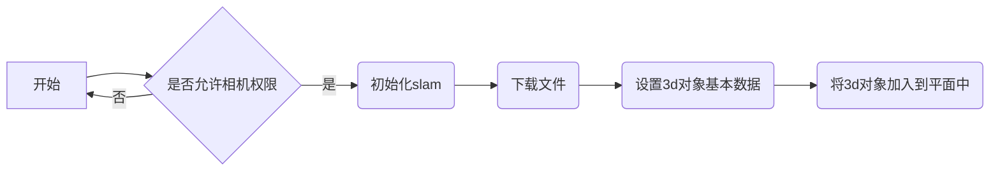

# wechat-kivicube-slam-plugin-api-sample

> 描述：此项目是基于 **kivicube-slam** 插件 开发的示例小程序。
> 项目大量使用了文档中提供的api，给开发者展示了一个比较完整的开发示例和开发流程。

---

>声明：所有的示例代码仅供大家开发参考，若移植到自己的项目后有任何问题，请先自行检查和确认问题来源。确实为组件问题的，请创建Issues反馈。

## 目录说明
<pre>
.
|
├──components                     // 组件
│    ├── loading                  // loading组件
│    ├── audio-player             // 音频播放组件
│    ├── video-player             // 视频频播放组件
│    ├── card                     // 商品详情的card
│    
├── pages                         // 页面
│    ├── index                    // 默认页面
│          ├── Food.js            // 封装的食物的类
├── static                        // 一些静态资源
├── utils                         // 一些工具方法
</pre>

## 流程简介
**slam项目基础流程图如下所示**

## 快速体验

1. 使用git克隆此仓库至本地，可使用命令git clone git@github.com:kivisense/wechat-kivicube-slam-plugin-api-sample.git，或者点击右上角按钮Code -> Download ZIP下载代码。
2. 使用微信开发者工具导入本项目。重要：在“导入项目”时，必须将AppID修改为，被我们license授权过的appid。
3. 打开app.js文件，替换为我们给予你的license。
4. 服务器域名配置。有两种方案，一是直接在手机上打开小程序的“开发调试”模式，参考vConsole；二是在小程序后台，将域名“ https://kivicube-resource.kivisense.com ”配置到request和downloadFile两项中，参考微信官方文档 - 网络。推荐第二种。
5. 之后，可在微信开发者工具上，点击“预览”按钮，用微信扫描打开体验。【Slam功能不支持在开发者工具上运行，也不支持真机调试。】

